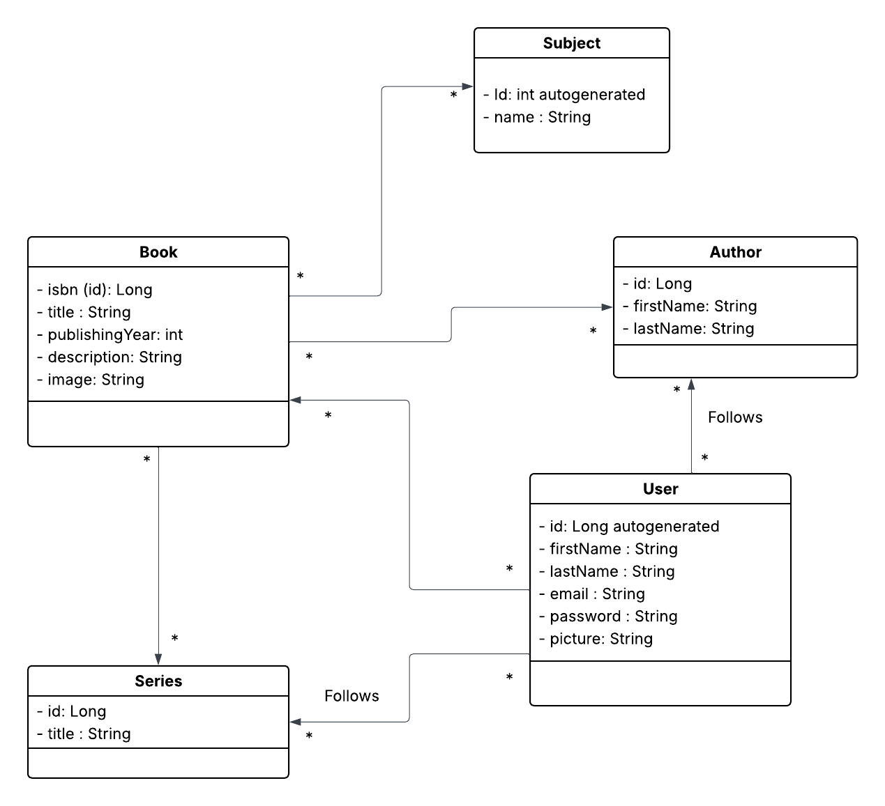

# Booksta

A full-stack web application that allows users to browse a book catalog, manage reading lists, interact with a community of readers, and access author, librarian, and seller features.

---

## Technologies Used

### Backend — **Java Spring Boot**

* Java 17
* Spring Boot 
* Spring Web
* Spring Data JPA
* Hibernate
* Spring Security
* Maven
* MySQL / PostgreSQL / Azure SQL

###  Frontend — **React**

* React 18
* React Router
* Axios
* Tailwind CSS / Material UI (optional)

###  Tools

* Git & GitHub
* Postman
* Docker (optional)
* IntelliJ IDEA / VS Code

---

##  Project Structure


## UML 



##  Installation & Setup

###  Backend (Spring Boot)

```bash
cd backend
mvn clean install
mvn spring-boot:run
```

Backend runs at:
👉 [http://localhost:8080](http://localhost:8080)

---

###  Frontend (React)

```bash
cd frontend
npm install
npm start
```

Frontend runs at:
 [http://localhost:3000](http://localhost:3000)

---

#  Features & User Stories

##  User Features

* Browse a book catalog with search filters (author, genre, publication year...).
* Create and manage a personal reading wishlist.
* Rate and review books.
* Track books they own.
* View similar book recommendations.
* Follow authors and book series.
* Chat with other readers.
* Track and share reading progress.
* Create and share thematic book collections.
* Create private discussion groups.
* Find book sellers (new or second-hand).

---

##  Author Features

* Manage information about published books.
* Share news and announcements.
* Track community interest and reactions.
* Participate in the platform as a regular user.

---

## 📚 Librarian Features

* Edit book catalog information.
* Access a shared error reporting system.

---

## 🛒 Seller Features

* Manage stock and inventory of books.

---

## 🧑‍💻 Developer Feature

* Create the homepage of the platform.


# Deployment

## Cloud Provider — **Microsoft Azure**

The platform is deployed on **Microsoft Azure** using the following services:

* Azure App Service → Hosts the Spring Boot backend
* Azure Static Web Apps or Azure Storage + CDN → Hosts the React frontend
* Azure SQL Database / PostgreSQL → Database storage
* Azure Key Vault → Secure secrets and connection strings
* Azure Monitor & Application Insights → Logging, metrics, monitoring

---

##  Infrastructure as Code — **Terraform**

All cloud resources are created and managed via **Terraform**, ensuring reproducible, automated infrastructure.

Terraform manages:

* Resource Groups
* App Service & App Service Plans
* SQL servers & databases
* Static website hosting
* Key Vault (secrets)
* Networking & configuration

**Workflow:**

```bash
terraform init
terraform plan
terraform apply
```

---


## Team members

* Iman Azoioui
* Efrahim Aslan
* Ilyas	Rabhioui
* Sorin	Sîrbu
* Wassim El Abboudi
* Emad	El Boustati
* Samale Moussa
* Ilyes	Rusi Hasani
* Souhaib El Hassouni
* Sohaïb Krimou
* Abdelrahman Meroual


## 🧪 Testing

### Backend

```bash
mvn test
```

### Frontend

```bash
npm test
```


## Conventional Commits Standard

### Format: "type"[scope]: "description"

- type: feat (new feature), fix (bug fix), docs, refactor, test, chore...
- scope (optional): Context of the change (e.g., api, ui).
- description: Short, in imperative mood (e.g., "add X function").
- Body/Footer (optional): For "BREAKING CHANGE" or linking issues.

## Issue Creation Standard

### For effective management, every issue should include:

1. Clear and Concise Title: Summarize the problem or request.

- User Stories: Use the format US00[BE-FE]: description
    - US: Stands for User Story.
    - 00: story's number.
    - [BE-FE]: frontend / backend.
    - description: Short summary of the story.

- Bugs: Start with Bug: (e.g., Bug: Login button is not working).

2. Detailed Description:

- Bug: Steps to reproduce, expected result, actual result.
- Feature: Description of the need ("Why?") and proposed solution ("What?").

3. Labels: Use appropriate labels (e.g., bug, feature, documentation, urgent).

4. Assignee (Optional): If possible, assign the issue to a team member.

## Running the Project

`mvn spring-boot:run`

### With docker compose

`docker-compose up`


